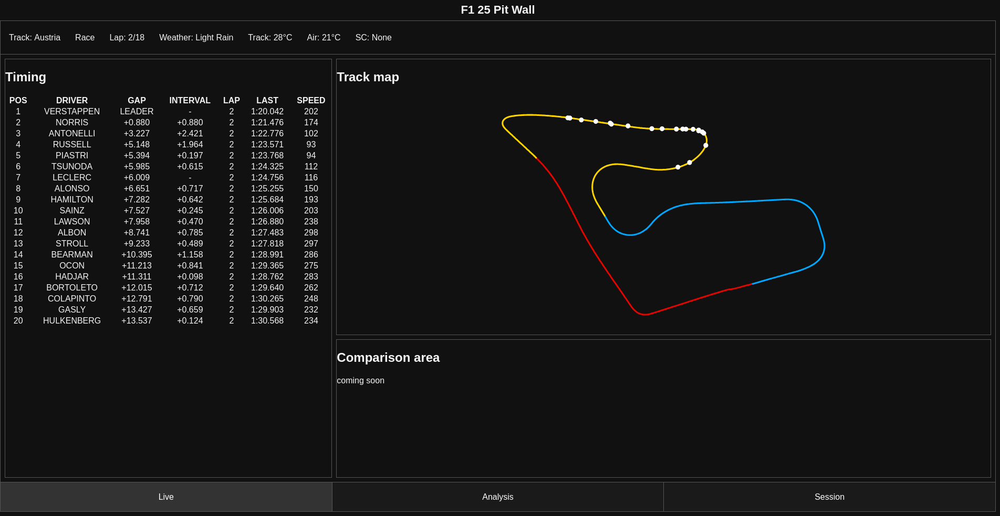
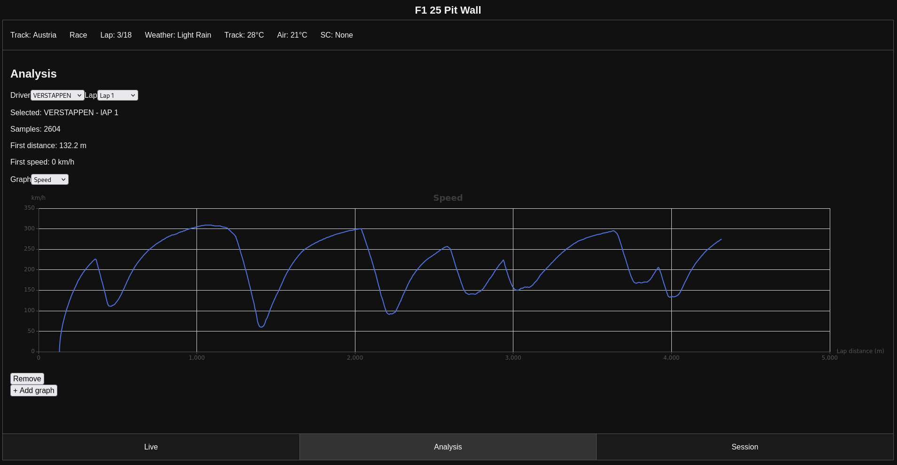
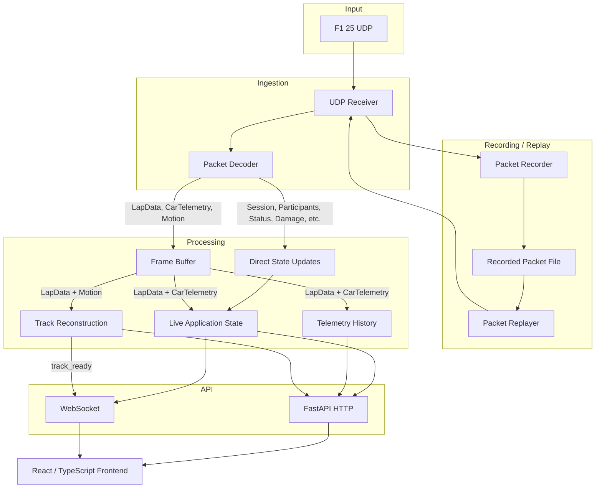

# F1 25 Pit Wall

## Overview

A real-time telemetry dashboard for **EA SPORTS F1 25** designed around live data processing, visualisation and analysis problems found in motorsport software.

The application ingests UDP packets sent by the game, decodes and aligns independent packet types, maintains a live session state and historical telemetry for drivers, reconstructs circuit geometry dynamically from vehicle positions, and exposes results via FastAPI/WebSockets in the backend to a React/TypeScript dashboard.

> **Status:** Active development. The live timing tower, track reconstruction and map, lap history and initial analysis tools are implemented. Current progress is focused on expanding the existing analysis features.




## Features

- **UDP decoding + frame alignment**
    - Parses multiple F1 25 packet types
    - aligns LapData and CarTelemetry packets by frame for accurate telemetry history
    - aligns LapData and Motion packets by frame for accurate positioning for track map building
    - handles packet loss and out-of-order packet arrival

- **Live timing + session state**
    - Displays a timing tower containing each driver
    - Contains live positions, gaps, intervals and lap number
    - Displays information about the session, including current weather, track name and session type

- **Historical Telemetry**
    - Stores per-lap historical telemetry for each driver as laps are completed
    - These records contain distance, speed, throttle, brake, steer, gear, RPM and DRS status
    - Is resilient to in-game flashbacks

- **Dynamic Circuit Reconstruction**
    - Reconstructs track map from car world positions and distances
    - Splits track into 5m distance bins, and combines per-car median positions across multiple drivers, and requires full-track coverage and high multi-car coverage before finalising the geometry, to reduce noise and outliers.
    - Records sector bounaries and highlights each individual sector
    - Displays live car positions on the reconstructed map

- **Analysis**
    - Selectable telemetry vs lap distance graphs
    - Multiple graph panels, allowing for speed, throttle, brake, steering, gear and RPM to be plotted
    - Note that lap comparison and deeper analysis is still ongoing

- **Replay System**
    - Packet recorder receives raw UDP packets, and saves them timestamped to a binary file.
    - Packet replayer can send these packets to the same port F1 25 does with the original intervals between each packet.

## Architecture



## Tech Stack

| Area | Technologies |
|---|---|
| Backend | Python, FastAPI, WebSockets, NumPy |
| UDP / Protocol | Python sockets, `struct` |
| Frontend | React, TypeScript, Vite, Apache ECharts |
| Testing | pytest |

## Running Locally

### Prerequisites

- **Python 3.10+**
- **Node.js and npm**
- **EA SPORTS F1 25** (only for live telemetry data)

The application can also be run using previously recorded UDP data without launching the game.

### Backend

From the repository root:

```bash
cd backend

python -m venv .venv
```

Activate the virtual environment:

**Windows**

```bash
.venv\Scripts\activate
```

**macOS / Linux**

```bash
source .venv/bin/activate
```

Install the Python dependencies:

```bash
pip install -r ../requirements.txt
```

Start the FastAPI server:

```bash
uvicorn api.server:app --reload
```

The backend will run on:

```text
http://127.0.0.1:8000
```

### Frontend

In a separate terminal:

```bash
cd frontend
npm install
npm run dev
```

Vite will display the local URL for the dashboard, normally:

```text
http://localhost:5173
```

### F1 25 UDP Configuration

For live telemetry, enable UDP telemetry in the F1 25 settings and configure it to send data to:

```text
IP: 127.0.0.1
Port: 20777
```

The backend receiver listens for the game's UDP packets and processes them automatically while the FastAPI server is running.

### Replay

Recorded sessions can be replayed through the same UDP receiver used for live game data.

Note that the replay system is going to be overhauled, but for the current version, the following instructions can be used to record and replay data:

#### Recording

In the `backend` directory, run:

`python3 -m udp.receiver --record`

Now, start an F1 25 session with the configuration from above. The receiver will capture and timestamp all incoming packets whilst the receiver is active. These packets will be saved to `backend/recordings/test.bin`, overwriting the file if it already exists.

#### Sample Recording

A sample telemetry recording is available for testing the replay system without running F1 25.

Download it from the [v0.1.0 release](https://github.com/LiamK520/F1-25-Pitwall/releases/tag/v0.1.0), extract the archive, and place `test.bin` at:

`backend/recordings/test.bin`

Then follow the replay instructions below.

#### Replaying

Ensure that the backend server is running. Then, to replay the recorded packet stream, run:

`python3 -m udp.replayer`

From the `backend` directory. This will replay the packets saved in `backend/recordings/test.bin`.

## Roadmap

The project is under active development. Planned features include:

- **Expanded telemetry analysis**
    - Graph comparisons for multiple drivers and multiple laps
    - Lap delta analysis across lap distance
    - Analysis of corner performance such as braking point, minimum speed etc.
    - Comparisons with reference laps, e.g. a driver's personal best lap on the same compound

- **Practice and setup analysis**
    - Link telemetry to car setups, tyre compounds and stints
    - Compare different setups and tyre behaviour across practice stints
    - Estimate qualifying and race performance from practice data

- **Session persistence**
    - Store session information such as lap information, stints, driver information etc. in a database
    - Support queries for stored sessions such as fastest driver on agiven lap, when a driver set their fastest lap etc.
    - Also persist track map once constructed, and load directly from disk if it already exists.

- **Recorder / replay improvements**
    - Allow replay controls such as fast forward, rewind, pausing etc. whilst preserving internal state
    - Allow recording/replaying directly from frontend

- **Additional telemetry**
    - Add marshal zone flag highlighting to live circuit map
    - Extend frame aligned data with information such as ERS, fuel and tyre wear for more analysis parameters

- **Track reconstruction improvements**
    - Investigate methods to improve track map construction, primarily by attempting to estimate the track centerline rather than the racing line which is currently constructed.

## Disclaimer

This is an unofficial project and is not affiliated with Formula 1 or EA Sports.